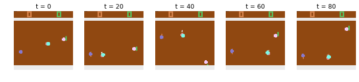
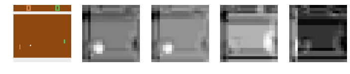
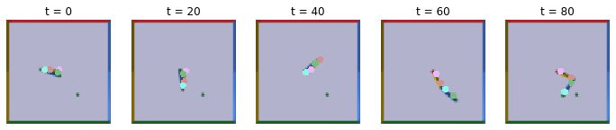

# Unsupervised Learning of Object Keypoints for Perception and Control

https://arxiv.org/abs/1906.11883






To generate data for training on Atari Pong. Run 

```python
python generate_data.py
```

Check `python generate_data.py -h` for usage.

To train the Transporter model. Run 

```python
python train_pong.py
```

A notebook `demo.ipynb` has also been added for demonstration purpose. The notebook includes visualization of
the (un)normalized heatmaps generated by the PointNet.
